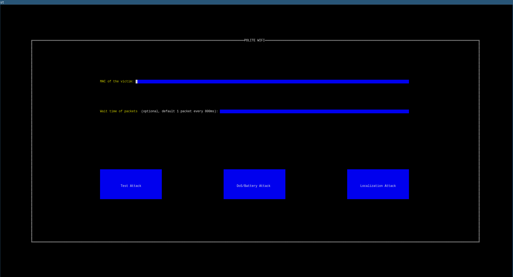

# 1. Overview

In this project I will try to implement an attack to the 802.11 physical layer known as "Polite WiFi", first documented by professor Ali Abedi and professor Omid Abari in their 2020 paper [WiFi Says "Hi" Back to Strangers!](https://web.cs.ucla.edu/~omid/Papers/Hotnets20b.pdf). I will also try to replicate some of their experiments and check if my own research matches with their results.

To do that, I will write the software that carries on the attack (using the Golang programming language) and use it on different types of devices, in order to check if they are vulnerable and if the attacks can actually pose a threat to them.

# 2. Explaination of the attack

## 2.1 Why does the attack happen

The 802.11 protocol uses small packets, called Acknowledgments or "ACKs", as an error control mechanism: if a sender sends some data, the receiver has to send back an ACK to tell the sender that the transmission was successfull. This mechanism is important since the 802.11 protocol is used for wireless communications in the ISM band, a non licensed spectrum portion which may have interferences that lead to packet loss. There are also timing restrictions, ACKs need to be sent very fast after reception of a packet, in order to avoid retransmission while keeping perfomance.

The two researchers have shown that, due to the timing restrictions of the protocol, when a packet is received the 802.11 physical layer doesn't actually check if the MAC layer of the protocol is valid, but replies with an ACK even if the packet was "unexpected"; the only checks made are really fast, mainly the Cyclic Redundancy Check (CRC). Only after that the ACK is sent the MAC layer of the packet gets processed and eventually dropped. An example of "unexpected" packet could be a Data packet sent to a device that is part of a WLAN from a device that is not part of the WLAN.

## 2.2 How can this behaviour be exploited

In the original paper there are many different ideas on how this "polite behaviour" can be exploited; the main point that the two researchers argue is that there are types of attacks that were belived possible only by being connected to the same WLAN as the victim, which makes them harder to actually implement, but many of them become easier and viable using this technique.

I've mainly focused on three types of attack:

1. Denial of Service, where the attacker sends repeatedly packets to a victim, which is therefore unable to process valid packets because it's busy sending ACKs to the attacker
2. Battery Draining, where the attacker sends repeatedly packets to a victim that is battery powered, which is therefore unable to go into "sleep mode" and drains its battery to send ACKs to the attacker
3. Localization, where the attacker sends repeatedly packets to a victim and uses the Received Signal Strength Indicator of the ACKs to localize the victim

# 3. Implementation of the attack

I've decided to reimplement the attack using Golang, a programming language with a lot of good networking libraries and an intuitive way of handling concurrency; to create, send and sniff packets I've used [gopacket](https://github.com/google/gopacket), a Google Golang wrapper around libpcap.

## 3.1 Interfaces

The code offers two types of interfaces to perform the attacks:

1. A CLI, that accepts the following parameters:
	+ ``-m`` for the victim's MAC address
	+ ``-w`` to specify the waiting time between each packet in ms [optional]
	+ ``-t`` to perform a Test Attack
	+ ``-d`` to perform a Denial of Service or a Battery Draining Attack
	+ ``-l`` to perform a Localization Attack

2. A TUI, made using the [tview](https://github.com/rivo/tview/) library, where there are buttons to choose each type of attack

The different attacks are implemented in more or less the same way in all interfaces

## 3.2 Attacks

### 3.2.1 Test Attack

Two threads are spawn: one crafts the packet and waits to transmit it, while the other one uses an eBPF filter to only sniff ACKs coming from the victim.

A single packet is sent and if the ACK is received a confirmation is shown to the user.

### 3.2.2 Denial of Service or Battery Draining Attack

Two threads are spawn: one crafts the packet and waits to transmit it, while the other one uses an eBPF filter to only sniff ACKs coming from the victim.

Another thread (the main one in the CLI) takes care of waiting a wait time (defined by the user) and sending a periodic message to actually send the packets.

The attack goes on until it's manually stopped by the user.

### 3.2.3 Localization Attack

Two threads are spawn: one crafts the packet and waits to transmit it, while the other one uses an eBPF filter to only sniff ACKs coming from the victim.

Another thread (the main one in the CLI) takes care of waiting a wait time (defined by the user) and sending a periodic message to actually send the packets.

Another thread reads the sniffed ACKs and shows to the user their RSSI.

The attack goes on until it's manually stopped by the user.

## 3.3 Hardware and Additional Software

To perform the experiments I've used a laptop with Debian 11, with a Realtek RTL8188EE Wireless Network Adapter, capable of activating monitor mode (using [airmon-ng](https://aircrack-ng.org/doku.php?id=airmon-ng)). To check if the attacks actually worked before while writing the software implementation I've used both [wireshark](https://www.wireshark.org/) and [tcpdump](https://www.tcpdump.org/).

# 4. Experimental results and observations

## 4.1 Feasibility of the attack

I've decided to test the attack on multiple devices

### 4.1.1 Phones and Laptops

I wasn't able to perform the attack on a Samsung Galaxy S10 phone or on a Dell laptop with a Intel Wi-Fi 6 AX201 Wireless Network Adapter.

### 4.1.2 Access Points

I found that a FASTWEB RTV1907VW was vulnerable, even while functioning as an AP. I used this for the DoS Attack.

### 4.1.3 Microcontrollers

I found that an Espressif ESP32 was vulnerable but only if it wasn't connected to a WLAN: as soon as it connected to any WLAN, the attack would stop working. I used this for the Battery Draining and Localization Attacks.

### 4.1.4 Observation on MAC addresses

The original paper doesn't mention the problem of finding the correct MAC address of the chosen victim: with MAC spoofing and MAC randomization, it could be hard to pinpoint exactly the victim's address, so all the attacks assume that the address is known by the attacker, but that it's almost unlikely.

## 4.2 Denial of Service Attack

I've tried performing a DoS Attack to my AP and I've measured, using ping, the difference in trasmission speed from when the attack was running to when it wasn't and the results were surprising: despite sending 1 packet each millisecond to the AP, there was no noticeable speed drop in transmission. This could be used as evidence that this attack cannot be used to perform Denial of Service attacks.

## 4.3 Battery Draining Attack

My setup was composed of an Espressif ESP32 microcontroller, powered by a 9000 mAh battery pack with a display showing the percentage of power left. I wrote a script that periodically turned on the wireless interface, woke up the device and sent a ping to a server; in 2 hours of running the experiment, the battery didn't lose any percentage of power. I let the same device, with the same script running, while performing an attack, sending 1 packet each 3 ms, and only saw a 1% decrease in power in the same time period. Even though it isn't much, this still shows that this 802.11 behaviour could theoretically be used to accelerate the power usage of IoT devices.

I unfortunately didn't have any access to electrical instrumentation capable of measuring the actual difference in power consumption between the two states.

## 4.4 Localization Attack

This is probably the most effective attack that I took on. As shown in the video below, it's possible to walk around with a device that is running the attack and localize it, moving towards the direction that maximizes the RSSI.

# 5. Conclusions

As my small research shows, the claims of the original paper should be reduced. It's possible that in the two years that have passed since the writing of the paper devices have actually improved and implemented safety features to contrast this types of attacks, but just the fact that I've found devices that are older than the paper but not vulnerable to the attack denies the claim that every WiFi device is vulnerable to it.

Other than the research, the main contibute of this project is the implementation of the attack, that makes it easier to perform it and to test a wider number of devices.
